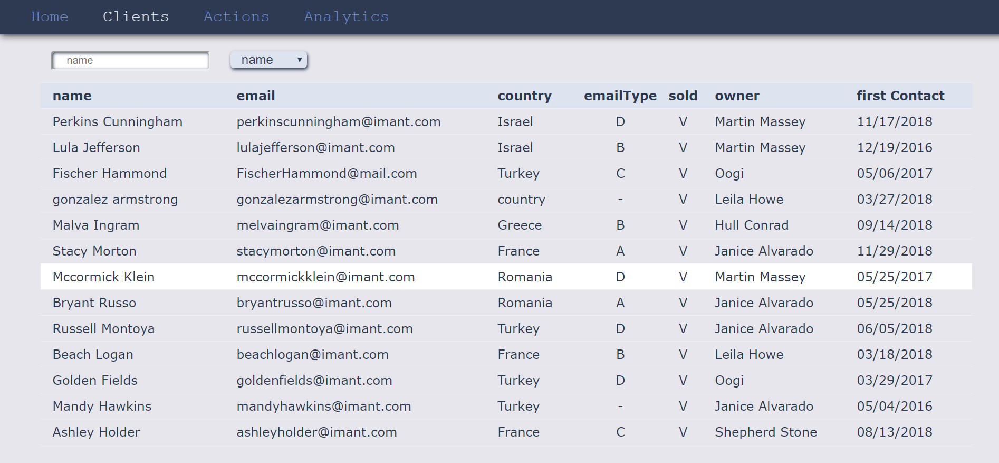
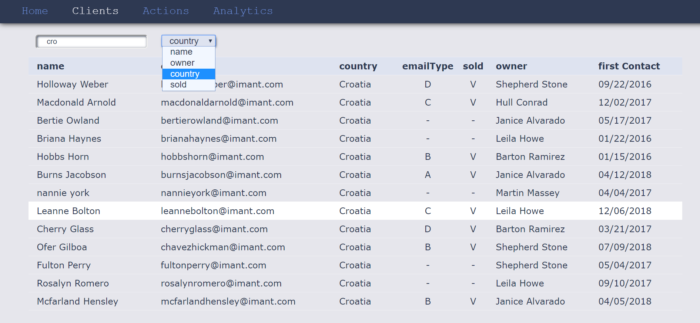
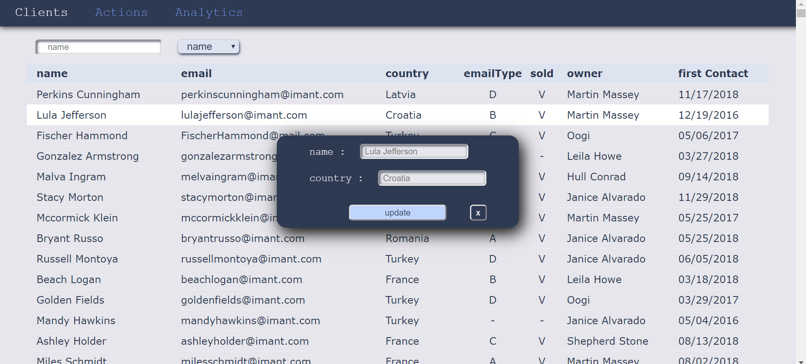

## CRM- Customer Relationship Management

A web app for tracking and modifying multiple clients information. 

#### check it out for yourself: https://crm-ofer-gilboa.herokuapp.com/

```diff
# ##### Landing page
```


#### All clients 


#### Clients filtered by _______:


#### Double click a client to update its name or country


#### Update or add a client


#### Dynamically updates  


### Built With:
- React
- Node.JS
- Express
- MongoDB
- npm packages


